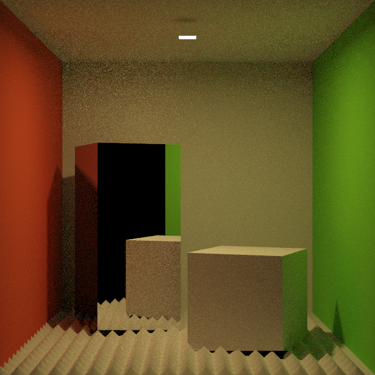
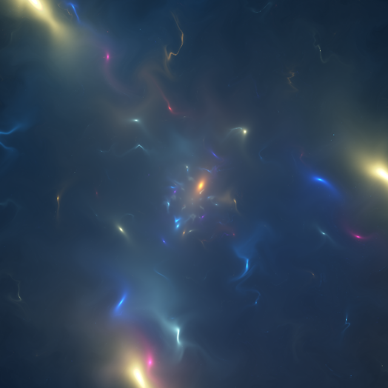

Pine contains a rendering library and a jit-compiled language with access to most of the library's features.  
It enables the use of procedure approach to generate complex geometires, scenes, ... or at least I hope

The following is an example `.pine` scene file written in Pine Rendering Language(PRL):
```
scene := Scene();
image_size := [640, 640];

scene.add("floor", Diffuse([0.9, 0.9, 0.9]));
scene.add("red", Diffuse([0.9, 0.1, 0.05]));
scene.add("green", Diffuse([0.2, 0.9, 0.05]));
scene.add("metal", Metal([1, 1, 1], 0.0));
scene.add("glossy", Glossy([1, 1, 1] / 4.0, 0.05));
scene.add("skin", Subsurface([1, 1, 1], 0.0, 40.0));

scene.add(Rect([0, 0, 1], [2, 0, 0], [0, 0, 2]), "floor");
scene.add(Rect([0, 2, 1], [2, 0, 0], [0, 0, 2]), "floor");
scene.add(Rect([-1, 1, 1], [0, 0, 2], [0, 2, 0]), "red");
scene.add(Rect([1, 1, 1], [0, 0, 2], [0, 2, 0]), "green");
scene.add(Rect([0, 1, 2], [2, 0, 0], [0, 2, 0]), "floor");

for x in -1.0 ~ 0.1 ~ 1.0 {
    for z in 0.0 ~ 0.1 ~ 2.0 {
        scene.add(Cone([x, 0, z], Y, 0.05, 0.05), "floor");
    }
}
scene.add(Box(AABB([0, 0, 0], [1, 1, 1]), translate([0.0, 0.0, 0.6]) * rotate_y(0.4) * scale([0.6, 0.6, 0.6])), "floor");
scene.add(Box(AABB([0, 0, 0], [1, 1, 1]), translate([-0.6, 0.0, 1.0]) * rotate_y(-0.4) * scale([0.6, 1.3, 0.6])), "metal");

scene.add(Rect([0.0, 1.9, 0.5], [0.1, 0, 0], [0, 0, 0.1]), Emissive(600 * [1.0, 0.64, 0.185]));

scene.set(ThinLenCamera(Film(image_size, Uncharted2()), [0, 1, -4], [0, 1, 0], 0.25));

PathIntegrator(BlueSampler(16), 4).render(scene);
scene.camera.film().save("images/cbox.png");

```
and it produces this image:  


Another:
```
# From https://www.shadertoy.com/view/XXyGzh
# By SnoopethDuckDuck
image_size = [640, 640];

draw(image_size, (u: vec2): vec3 {
    u *= image_size;
    v = vec2(image_size);
    u = 0.2 * (2 * u - v) / v.y;    
    w = u;
         
   o = [1, 2, 3.0];
   z = o;
   a = 0.5;
   t = 4.2;
    for i in 0..19 {
        a += 0.03;
        t += 1;
        t2 = vec2(t);
        v = cos(t2 - 7 * u * pow(a, i)) - 5 * u;         
        m = mat2(cos(vec2(i + 0.02 * t) - vec2(0, 11)), cos(vec2(i + 0.02 * t) - vec2(33, 0)));
        u = m * u;
        u += tanh(40 * dot(u, u) * cos(100 * [u.y, u.x] + t2)) / 200
           + 0.2 * a * u
           + cos(4 / exp(dot(o, o) / 100) + t) / 300;

        o += 0.4 * (vec3(1) + cos(z + vec3(t))) / length( (1 + i * length(v, v)) * sin(1.5 * u / (0.5 - dot(u, u)) - 9 * [u.y, u.x] + t2) );
    }
        
    w -= u;
   return pow((25.6 / (min(o, vec3(13)) + 164 / o) - dot(w, w) / 250), 4); 
}).save("images/storm.png");
```
producing:  
